# SOLUNA Sound

**The venue is the speaker. The crowd is the light show.**

SOLUNA Sound turns every phone, laptop, projector and cheap speaker in a space into
one phase-aligned system for **sound, light and video**. No app installs — one link,
one tap, and you're inside it. One server process verified at **10,000 concurrent
devices on a LAN** (cloud path measured to ~3k from a single test IP).

<p align="center">
  
</p>

<p align="center">
  <a href="https://soluna-sound.fly.dev/?zone=A"><b>▶ Live demo</b></a> ·
  <a href="https://soluna-sound.fly.dev/dj">DJ from your device</a> ·
  <a href="https://soluna-sound.fly.dev/admin">FOH console</a> ·
  <a href="https://soluna-sound.fly.dev/screen">Projector screen</a>
  <br><sub>MIT · Python server (aiohttp, ~500 lines), zero-dependency web clients · ja/en · PWA</sub>
</p>

## Try it in 60 seconds

```bash
git clone https://github.com/yukihamada/soluna-surround && cd soluna-surround
pip install aiohttp && python3 demo.py
```

Open the printed URL on **two phones**, tap ▶ on both — music, lights and (if you
fire one) video lock together. That's the whole product at living-room scale; the
same stack runs a festival.

---

## Architecture

```
                       ┌─────────────────────────────┐
   DJ (any browser) ──▶│        SYNC SERVER          │◀── FOH console /admin
   /dj mic·line·file   │  one aiohttp process        │    zones · align · cues
   source.py --input   │  = single clock authority   │    lights · geo · upload
                       └──────────┬──────────────────┘
                 WebSocket /audio │  JSON control + SL2 binary PCM
        ┌─────────────────┬──────┴────────┬──────────────────┐
        ▼                 ▼               ▼                  ▼
   audience phones   speaker nodes   /screen (Mac+HDMI)   Koe iOS app
   PWA, no install   play.py on Pi   projector / LED      background audio,
   sound+light+video  ±1–3ms wired    wall, same clock     lock-screen safe
```

**One server process is the single source of time.** Everything else — 10,000
phones, Raspberry Pi speakers, a projector — independently synchronizes its own
clock to it and schedules media locally. Nothing streams in lockstep; devices
*agree on when*, then play on their own. That's why it scales.

### How the clock sync works

1. Every client pings: `{t:"ping", c:<local monotonic ms>}` → server replies
   `{t:"pong", c, s:<server epoch ms>}`.
2. Client computes `offset = s + rtt/2 − now` per sample, keeps a 30-sample
   window, and uses the **median of the 3 lowest-RTT samples** (robust against
   asymmetric routes). Pings run at 500 ms until converged, then relax to 3 s.
3. `serverNow() = localMonotonic + offset`. On a LAN this lands within ±1–3 ms;
   over LTE typically ±10–20 ms.

### How audio plays in phase (CUE mode)

- The track is **pre-distributed** (`preload`): every device fetches and decodes it
  before showtime, so FIRE causes zero download burst.
- FIRE broadcasts only `{url, at}` where `at` is a server-epoch instant for
  sample 0. Each device schedules `AudioBufferSource.start()` at
  `at + delay − outputLatency` mapped through its clock offset:
  - `delay = distance/343 + 15 ms` — places this device's sound exactly on the
    stage wavefront (the 15 ms Haas offset keeps the image on stage);
  - `outputLatency` — the device's own hardware buffer (`ctx.outputLatency`),
    which differs 10–30 ms between phone models and would otherwise smear the sync.
- A device that joins mid-track computes its position from the same clock and
  starts *inside* the track, already in phase. Loops re-derive position modulo
  duration.
- **LIVE mode** (DJ/mic): SL2 binary frames (22-byte header + int16 PCM) carry a
  `playAt` driven by a sample counter, never by arrival time — network jitter
  cannot bend the timeline; a late frame is dropped, never played out of phase.
  Pipeline lead is configurable down to 80 ms for blending into a house PA.

### How the light show needs zero bandwidth

`/api/light` broadcasts only *pattern + colors + epoch*. Every device computes its
own color each frame from `(zone position, synced time)` — so a wave literally
sweeps across the crowd, and `audio` mode pulses to an RMS envelope the device
computed **locally from the already-downloaded track** (onset detection: a hit
flashes color 2 at full brightness). Strobe is capped at 3 Hz for photosensitivity.
Patterns: `solid · pulse · beat · wave · plasma · strobe · audio`.

### How video stays in sync

Video is a cue with a `video` url: pre-fetched to a blob, then a per-frame loop
compares `video.currentTime` against the synced clock — >0.5 s off hard-seeks,
smaller drift is absorbed by ±6% `playbackRate`. Measured: 23 ms playback drift,
2 ms on mid-track loop join. Pair it with an audio cue (extract the soundtrack to
mp3) and the video mutes itself: sample-accurate audio + ≤50 ms video.

### How zones disappear (GPS auto-delay)

FOH taps "use my location" once at the stage (`/api/geo`). Each phone then
measures its own GPS distance and computes its delay **continuously**
(`d/343 + 15 ms`) — median of the last 5 accepted fixes, re-syncing mid-track only
when moved >3.5 m ( =10 ms) and at most every 8 s, so playback never stutters.
Zone flags remain the fallback when location is denied; a ±50 ms per-device FINE
TRIM slider nulls any residue by ear.

### Running the whole night

The console is not just buttons — it runs a show. Build a **setlist** where each
step bundles a track, a video and a light look; the **NEXT** button fires them as
one synchronized moment. A single zone can be **walk-tested** (`{zones:["B"]}`
targets cue delivery) while the rest of the field stays silent. And the show is
**crash-safe**: zones, alignment, stage geo, the active cue/light and the setlist
position persist to `state.json` and come back on boot. Zone flags print
themselves from `/flags` — A4, big letter, QR straight into the zone.

### Running it for real (operations)

- **Observability** — every device reports what it is *actually* doing
  (`preloaded / playing / idle / failed`, AudioContext state, battery, sync accuracy;
  never its location). `/status` aggregates them and the console shows
  *"how many are really sounding"*, per zone — not just how many are connected.
- **Speaker nodes run the same show** — `play.py` (Raspberry Pi) receives CUE,
  PRELOAD, walk-test, SHOW steps and LIGHT (forwarded to a `--light-cmd` GPIO hook),
  decodes any format via ffmpeg, joins mid-track, reconnects forever. One-shot Pi
  install with a systemd service (output auto-picked: USB DAC > GPIO I2S DAC > built-in):
  `curl -fsSL …/tools/pi-setup.sh | SERVER=wss://… ZONE=B bash`
  GPIO I2S DAC boards without an EEPROM (PCM5102A / MAX98357A) need the overlay once:
  add `DAC=hifiberry-dac` to that line (`hifiberry-dacplus` for PCM5122), then reboot.
- **Clock authority is monotonic** — the server timestamps from `monotonic()`
  anchored once at boot, so an NTP step on the host can never jump the crowd.
- **Hot standby** — `GET /api/state` exports the whole show; `POST /api/state` on a
  second machine re-broadcasts it and phones resume mid-track. Both laptops NTP-synced
  → cue epochs stay valid across the switch.
- **Power** — audience screens auto-dim to black after 45 s idle (light show
  excepted), GPS drops from continuous watch to 60 s polls once the distance settles,
  battery level is reported so FOH can see a crowd running low.
- **Show control, the festival's way** — SOLUNA slots under the systems a show already
  runs instead of adding an operator: **OSC in** (`SOLUNA_OSC_PORT`; QLab / Ableton /
  grandMA / Eos fire `/soluna/cue`, `/soluna/go`, `/soluna/light`… — same code path as the
  HTTP API, future-timetag bundles become the cue's `at`), **timecode** (`POST
  /api/timecode` or `ltc.py` decoding LTC audio → cues and setlist steps take
  `"tc":"01:00:10:00"`, 24/25/30/29.97DF), and **Art-Net / sACN out** (`SOLUNA_ARTNET`,
  `SOLUNA_SACN`: the running light pattern rendered to DMX at 40 Hz so real fixtures wave
  in step with the phones). All off by default; details in `docs/show-control.md`.
- **Level trim** — a per-device ±12 dB slider (phone speakers differ by 6–10 dB
  between models) plus per-zone gain from the console.
- **Asset delivery** — `/assets/` is served with `Cache-Control: public` and CORS;
  set `SOLUNA_ASSET_BASE=https://cdn…` and every device fetches tracks from your
  CDN/R2 **first**, falling back to the sync server if the object isn't there yet
  (PRELOAD burst leaves the VM entirely; an unsynced upload still plays).
  `tools/r2-sync.sh` pushes the assets folder to the bucket (R2: create bucket →
  `wrangler r2 bucket cors set --file tools/r2-cors.json` → custom domain → sync;
  note wrangler v4 needs `--remote` on object puts, the script passes it).
- **Persistent data** — `SOLUNA_DATA_DIR` (a Fly volume at `/data` in the shipped
  config) holds tracks and `state.json` across redeploys.
- **Privacy** — coordinates never leave the phone; only the nearest zone letter is
  sent. The audience page says so, in ja/en.

### Wire format (SL2)

```
header (22 bytes, little-endian):
  magic "SL2" · ver u8 · nchan u8 · pad u8 · seq u32 · nsamp u32 · playAt f64
payload: interleaved int16 PCM
```

---

## The three faces

| Surface | Who | What |
|---|---|---|
| `/?zone=B` | audience | breathing gold orb, one ▶, everything else hidden behind "details". GPS auto-delay, fine trim, PWA-installable |
| `/dj` | performer | any device becomes the venue source: mic/line (music-grade, EC off), input-device picker, file playback, PA-fusion toggle, ON AIR glow, token auth |
| `/admin` | engineer | zones editor (meters in → live delays out), ±1 ms PA alignment, PRELOAD → FIRE cue flow with asset picker & upload, light-show VJ panel, stage-geo, per-zone device counts |
| `/screen` | projector | same client, one click: UI vanishes, cursor hides, video covers — a MacBook + HDMI is a stage screen on the same clock |

## API

| Endpoint | Description |
|---|---|
| `WS /audio?role=listen&ch=&zone=` | listener (JSON control + SL2 binary) |
| `WS /audio?role=push&ch=&token=` | source (hello `{map,sr,lead}` + SL2 frames); token required when `SOLUNA_DJ_TOKEN` is set |
| `POST /api/cue` | `{url?, video?, lead\|at, gain, loop}` · `{preload:true}` · `{stop}` |
| `POST /api/light` | `{pattern, colors, bpm, speed, brightness}` / `{stop}` |
| `POST /api/zones` | `{zones_m:{A:0,B:15,…}}` measured meters → live delays |
| `POST /api/net` | admin | `{"ssid":"SOLUNA-Front","wifi_zones":["A","B"]}` — phones in those zones show "join venue Wi-Fi", the rest "stay on mobile data"; `{"clear":true}` removes |
| `GET /api/preload` | public, tiny | `{url, video, asset_base}` — what a phone should prefetch; used by the gate QR (`/flags?gate=1`) before any WebSocket is opened |
| `POST /api/timecode` | admin | `{"tc":"01:00:00:00","fps":30}` — "right now the show timecode is X" (also OSC `/soluna/tc`, or `ltc.py` from LTC audio); then `/api/cue` and setlist steps accept `"tc":"01:00:10:00"` instead of `lead`. 24/25/30/29.97DF. `GET` returns the anchor + estimated current tc |
| OSC `udp/$SOLUNA_OSC_PORT` | LAN, no auth | `/soluna/cue url [lead] [gain]` · `/soluna/preload` · `/soluna/stop` · `/soluna/go` · `/soluna/show/goto i` · `/soluna/light pattern [c1] [c2] [bpm]` · `/soluna/light/stop` · `/soluna/align ms` · `/soluna/zone name ms` · `/soluna/tc "HH:MM:SS:FF" [fps]` — trailing `"ch=<name>"` selects a channel; bundle timetag → `at`. See `docs/show-control.md` |
| DMX out `SOLUNA_ARTNET` / `SOLUNA_SACN` | env | `ip[:universe]` — active light pattern → Art-Net ArtDMX / sACN E1.31 at 40 Hz, `SOLUNA_DMX_FIXTURES` RGB fixtures from `SOLUNA_DMX_START`; blackout once on stop |
| `POST /api/align` | `{base_ms}` global trim vs house PA |
| `POST /api/geo` | `{lat,lng}` stage location for GPS auto-delay |
| `POST /api/upload?name=` | raw-body track/video upload → `/assets/<name>` |
| `POST /api/show` | `{steps:[{label, url?, video?, light?}]}` set the setlist · `{next:true}` fire the next step · `{goto:i}` jump |
| `GET /flags` | print-ready A4 zone flags with QR codes |
| `GET /api/assets` · `GET /status` | asset list · listeners/zones/cue/light/show state + `devices` summary |
| `GET/POST /api/state` | export / import the whole show (hot standby) |
| `DELETE /api/channel?ch=` | drop a test channel's saved state |
| `GET /health` | liveness (version, uptime, listeners) — used by Fly checks and CI smoke |
| `WS → {t:"report",…}` | device → FOH state report (state, ctx, battery, sync accuracy) |

Admin endpoints take `x-soluna-admin` (env `SOLUNA_ADMIN`). Broadcasts are
parallel with per-socket timeouts — one dying phone can't stall the crowd.

## Verified

| Test | Result |
|---|---|
| Protocol suite (`tests/`, runs in CI before every deploy) | 72 protocol + 20 node + 9 auth/load checks PASS (clock, identical cue epochs, mid-join, live re-broadcast, device reports, state export/import, cache headers) |
| **10,000 concurrent devices — one process, LAN** | 9,999/10,000 connected in 17 s, **cue reached 100%**, identical epochs, 791 ms delivery spread vs 8 s lead, median RTT under load 29 ms |
| Video sync | 23 ms drift; 2 ms mid-track loop join |
| Gate prefetch (headless browser) | `/?gate=1` reports *Ready* before any tap; the track sits in Cache Storage; the later fetch made **0 network requests**; per-zone network hint renders for Wi-Fi and LTE zones |
| Production E2E | join → sync → light → GPS auto-delay, headless browser vs the live deploy |
| **Real devices** | two iPhones, ears-on: music, light show and timecode video locked — then a real track with onset-flash lighting |
| **Physical Pi node** | Raspberry Pi 4 + GPIO I2S DAC (PCM5102A) joined the cloud deploy (`nodes=1`), took a zone walk-test cue, played in sync (±60 ms vs cloud clock, **±0.5 ms** when the server runs on the same Pi) |
| **Pi 4 as the server** (`tools/pi-server-setup.sh`) | **5,000 WebSocket clients** on one Pi 4: all connected in 12 s, cue reached 5,000/5,000 with 3.3 s spread (→ use `lead ≥ 5` at that size; default 3 s is fine to ~2,000); 2,000 clients → 0.9 s spread. LIVE PCM from `source.py` on the same Pi to its own node: 0 late frames. Node sync stayed ±0.5 ms under the 5k load |

Honest limits: the 10k figure is a local (LAN) measurement of the server process; a
10k run against the cloud deploy from a single test IP hits NAT limits at ~3k and
has not been re-run from distributed sources. Real crowds are 10k distinct IPs and
show-day runs the server on the FOH laptop or a Pi (LAN) anyway. The Pi-as-server
numbers are localhost; over a phone hotspot the same 2,000-client burst lost 15
connections and RTT went to 1.7 s while the Pi sat at ≤40 % CPU — **the radio, not the
server, is the ceiling**: one Pi's own Wi-Fi AP is good for tens of phones, a crowd
needs venue Wi-Fi/LTE, and wired Pi nodes carry the PA. iOS Safari stops web audio
on lock screen (the native Koe integration doesn't); LTE sync (±10–20 ms) is for
effects — wired nodes carry the main PA duty. Not yet done in the field: outdoor GPS
accuracy, dozens of real iPhones at once.

## Deploy

```bash
SOLUNA_ADMIN=<secret> SOLUNA_DJ_TOKEN=<secret> PORT=8900 python3 server.py
# show-control bridges (LAN only, all optional): OSC in, DMX out
SOLUNA_OSC_PORT=9000 SOLUNA_ARTNET=192.168.1.255:0 SOLUNA_DMX_FIXTURES=12 python3 server.py
```

Included `fly.toml` ships `connections` concurrency (20k hard) — the default
few-hundred cap silently rejects a crowd — a `/health` check, and a 1 GB volume at
`/data` (`SOLUNA_DATA_DIR`) so uploaded tracks and `state.json` survive redeploys.
CI runs the test suite first and smokes `/health` after the deploy.

```bash
python3 tests/test_node.py && python3 tests/test_protocol.py && python3 tests/test_djauth_load.py
```

### How it scales over the air (the radio is the ceiling)

The server holds thousands of clients; **what runs out first is Wi-Fi association
capacity** (≈50–80 phones per access point), not bandwidth — a CUE-mode phone sends one
~100-byte ping every 3 s, relaxing to every 10 s once stable (tightened again for a few
seconds when a cue lands). So:

1. **Audience = their own LTE/5G + this server (cloud) + CDN.** Zero venue infrastructure,
   ±10–20 ms — right for light, video, effects. Wired Pi nodes carry the PA.
2. **Gate prefetch kills the showtime burst.** Print the entrance QR (`/flags?gate=1`, or
   the 🎫 link in `/admin`): the phone downloads the track while queueing, into Cache
   Storage / the service worker, and FIRE later costs it zero bytes. Verified headless.
3. **Venue Wi-Fi only where ±1–3 ms matters** (front zones). Tell the phones:
   `POST /api/net {"ssid":"SOLUNA-Front","wifi_zones":["A","B"]}` — they show the hint
   themselves, LTE zones are told to stay on mobile data.
4. **Or make every Pi node an access point**: hang an outdoor AP off each node's Ethernet
   (PoE), 33 nodes × ~60 phones ≈ 2,000 on your own network. The Pi's built-in radio is
   not that AP (20–30 clients).
5. **Measure before deciding**: `docs/field-test.md` — 3 phones, 3 carriers, front / middle
   / back, pass criteria included.

### Pi as the server — the "SOLUNA box"

One Raspberry Pi can be the whole venue system: clock authority + speaker node, no
internet, no laptop. Phones and other Pi nodes sync to it.

```bash
# on the Pi (after pi-setup.sh if it should also be a speaker)
curl -fsSL https://raw.githubusercontent.com/yukihamada/soluna-surround/master/tools/pi-server-setup.sh | sudo -E bash
#  → systemd soluna-server on :8900, admin token in /opt/soluna/admin-token, data in /opt/soluna/data,
#    local node repointed to ws://127.0.0.1:8900 (±0.5 ms). AP=1 also raises a Wi-Fi hotspot (SSID SOLUNA).
# more speaker Pis, anywhere on the same network:
curl -fsSL …/tools/pi-setup.sh | SERVER=ws://<box>.local:8900 ZONE=C bash
# hot standby: same script on a 2nd Pi, then copy the show over
curl -s http://box1.local:8900/api/state -H "x-soluna-admin: $T" | curl -s -X POST http://box2.local:8900/api/state -H "x-soluna-admin: $T" -d @-
```

How it scales: CUE mode is control-plane only (media pre-distributed, one small JSON
per cue), so the server load is *connections*, not audio — a Pi 4 holds 5,000 (measured,
see Verified). Audience bandwidth is served by the venue network or a CDN
(`SOLUNA_ASSET_BASE`), never by the Pi. Measure your own setup with
`HOST=<box>:8900 SOLUNA_ADMIN=$T python3 tools/load-test.py 2000` — run it on the box to
size the server, from a laptop to size the network. LIVE (SL2 PCM) is the exception: it
streams 1.5 Mbit/s per listener, so keep LIVE for wired Pi nodes and give phones cues.

## Roadmap

- **Native iOS** — shipped as the Koe app's "Fest" mode (background audio,
  sample-accurate `AVAudioTime`, zone-flag QR deep links `koe://fest?…`); LED-torch
  sync next. Web/Android enter via `koe.live/fest`.
- **Acoustic auto-calibration** — a stage chirp measured by the mic: true acoustic
  distance, no GPS, no tape measure.
- **Crowd imaging** — per-device pixel coordinates so 10,000 screens can carry
  pictures, not just waves.
- **Node lighting driver** — a reference `--light-cmd` for WS281x strips on the Pi
  nodes (the hook and the pattern protocol exist; the LED driver script does not yet).
- **Acoustic level calibration** — pink-noise self-measurement through the phone mic
  to set the per-device trim automatically (today it is a manual ±12 dB slider).

---

# 日本語ドキュメント

## これは何か(主催者の方へ)

**来場者がスマホでQRを読んで▶を1回押すだけで、会場中の音・光・映像がミリ秒単位で揃う**
システムです。アプリのインストールは不要(iPhone/Android/PCのブラウザで動きます)。

- 客席のどこにいても「近くから、心地よい音量で、明瞭な音」が届く — 前方だけ爆音・後方は
  こもる、という大型PAの宿命を物理から解決します
- 合図ひとつで**全員のスマホ画面が同期したカラーライト**になり、光の波が客席を横切る。
  オープニング映像を1万台の画面+ステージスクリーンで同時に流すこともできます
- **既存の会場音響と共存**できます(メインスピーカーとサブは会場のものをそのまま使い、
  本システムは中後方の明瞭度と演出を担当)。単体でも完結します
- 実証済み: **1台のサーバで1万台同時接続(LAN実測)・合図の到達率100%**・実機iPhoneでの実聴テスト済み

### 主催者チェックリスト

| 必要なもの | 内容 |
|---|---|
| サーバ | ノートPC(Mac)1台。会場のLANに置く(クラウド版はリハ・配布用) |
| 来場者側 | 各自のスマホのみ。ゾーン旗のQR(またはGPS自動)で参加 |
| ゾーン旗 | `/flags` を開いてそのままA4印刷(ゾーン文字+QR入り) |
| 予備機 | ノートPCをもう1台(ホットスタンバイ)。主機の `/admin` → STATE → EXPORT で控えを取り、障害時は予備で IMPORT |
| 電池 | 来場者の画面は放置45秒で自動暗転・GPSは距離確定後60秒間隔に落として節電。FOHで電池20%未満の台数が見える |
| 位置情報 | 緯度経度は端末外へ出ません(最寄りゾーン記号のみ送信)。来場者ページに日英で明記済み |
| 会場との調整 | FOH卓のmatrix/aux出力を1系統(既存PAと融合する場合)・電源・持込機器の申請 |
| オプション | 客席内スピーカーノード(Raspberry Pi+アンプ、1台約$180)・スクリーン用Mac |
| 安全 | ストロボ演出は光過敏対策で3Hz上限を実装済み。音量は各端末で調整可能 |
| 副次効果 | 分散小音量なので**敷地外への音漏れが構造的に小さい** — 近隣・行政協議の材料になります |

機材構成・費用感・当日ランブックの詳細は設計書(SOLUNA Sound Grid)を参照してください。

## 音響エンジニアの方へ — 原理と運用

### 原理: ディレイタワーの細粒度化

音速は343m/s。従来のディレイタワーと同じ発想で、客席内の**すべての再生点(スマホ/ノード)に
「ステージからの距離 ÷ 343 + 15ms」のディレイ**をかけ、ステージ音の波面に正確に乗せます。
+15msのハース効果ぶんで定位はステージに残り、音圧と明瞭度は目の前の再生点が供給します。
低域は定位しないため、サブは従来どおりステージ集中(会場PAのものを使用)で問題ありません。
帯域の住み分けは「グリッド=おおよそ200Hz以上/会場PA=フルレンジ+低域」が自然に成立します
(ノード側が小口径のため)。

### 信号フロー

```
FOH卓 matrix/aux out ──▶ USBオーディオIF ──▶ source.py --input --lead 0.08
                                                    │ (SL2/48kHz/16bit,
                                                    ▼  srは自動追従)
                                              同期サーバ(Mac)
                                                    │ WebSocket
        ┌──────────────┬────────────────┬───────────┴──────┐
        ▼              ▼                ▼                  ▼
   来場者スマホ    Piスピーカーノード   /screen(映像)     Koe iOSアプリ
   (LTE/会場WiFi)  (有線/専用5GHz)     (Mac+HDMI)        (ロック中も再生)
```

### 同期の仕組みと精度

- 各端末はサーバとping/pongで時刻合わせ(片道=RTT/2と仮定し、**直近30サンプルのうち
  最小RTT側3点の中央値**を採用 — 経路非対称に強い)。収束後は3秒間隔に自動減速
- さらに**端末固有の出力レイテンシ**(`AudioContext.outputLatency`、機種間で10〜30ms差)を
  各端末が自己申告で差し引くため、機種混在でも揃います。残差は端末側の±50ms微調整で追い込み可
- 実測精度: 有線/専用AP **±1〜3ms** / LTE **±10〜20ms**(音の0.3〜7m相当)。
  したがって**主音響は有線ノード層、スマホ層は演出**という役割分担が設計意図です

### レイテンシバジェット(LIVE=既存PA融合時)

| 区間 | 値 |
|---|---|
| 取り込み(AudioWorklet)+SL2化 | 〜10ms |
| LAN往復+サーバ | 〜5ms |
| サーバ先読み(`--lead`) | **80ms(実測・可変)** |
| 合計パイプライン | **約95ms** |

パイプライン合計が「グリッド最前列の物理ディレイ(例: 30m=87ms)」を下回っていれば、
各端末が不足分を足して波面に乗ります。つまり**グリッドの最前列より手前は会場PAの担当**です。

### 当日ワークフロー

1. **設営**: サーバMacを会場LANへ。`/admin` を開く
2. **距離入力**: 各ゾーンのステージ距離をメジャー実測して ZONES に入力(全端末へ即時配信)。
   またはステージ前で「📍現在地をステージに設定」→ 来場者はGPSで自動ディレイ
3. **PA位相合わせ**: クリック/リムショットを会場PAとグリッド両方から出し、
   **フラム(二度打ち感)が消えるまで ALIGN を±5→±1msで追い込む**(全端末一括・即時反映)
4. **ウォークテスト**: ZONES表の🔊でそのゾーンだけに音を出し、歩いて確認。
   **音量差**は ZONES の gain(dB) で遠いゾーンを持ち上げる。機種差は来場者側の±12dBスライダー
5. **PRELOAD**: 開演30分前までに音源・映像を📥PRELOAD(全端末が事前DL — FIRE時の
   ダウンロード集中をゼロにする)。DEVICESパネルの **preloaded** が来場者数に近づくのを見る。
   大規模ならCDN/R2を `SOLUNA_ASSET_BASE` に指定して配布を同期サーバから外す
   (端末はCDN→サーバ直の順に取りに行くので、CDN未同期の曲でも止まらない)。
   アップロード後は `tools/r2-sync.sh` でバケットへ同期してからPRELOAD
6. **本番**: SHOWパネルにセットリスト(各ステップ=曲+映像+ライトの束)を組み、
   **NEXTボタンだけで進行**。単発はFIRE/LIGHTで割り込み可。DJ交代は `/dj` の
   トークン付き招待リンクを渡すだけ
7. **強制終了**(ハードカット): STOP 1操作で全端末即時無音・消灯
8. **障害時**: サーバ再起動でゾーン・位相・セットリスト・進行位置は自動復元
   (state.json)。電源が飛んでもサウンドチェックは消えない。**主機が死んだら**予備Macで
   STATE → IMPORT(控えは開演前に EXPORT)。端末は再接続後に進行中の曲へ曲中復帰する
   (両Macの時計をNTPで揃えておくこと)
9. **本番中の監視**: DEVICESパネル — **playing**(実際に鳴っている台数)/ **failed** /
   **ctx suspended**(ロック・サイレントで無音の可能性)/ **battery<20%**。接続数でなく
   「鳴っている数」を見る

### 音質・信頼性の仕様

- 48kHz/16bit PCM(SL2)。配信元のサンプルレート(例: Macの44.1kHz)は全端末が自動追従
- サーバの時計は**monotonic基準**(起動時に一度だけepochを取る) — ホストのNTP補正で
  全端末が一斉に飛ぶことがない
- Piスピーカーノード(`play.py`)はスマホと同じプロトコルを全部話す: CUE/PRELOAD/
  ウォークテスト/SHOW/ライト(GPIOフック)。ffmpegで任意形式をデコード・曲中合流・
  切断は必ず再接続
- ライブ系のフレームは**サンプルカウンタ駆動のplayAt**を持ち、ネットワークジッタで
  タイムラインが曲がらない。間に合わないフレームは「位相を崩して鳴らす」のではなく捨てる
- 全ブロードキャストは並列送信+ソケット毎タイムアウト — 瀕死の1台が全体を止めない
- 切断は自動再接続(音楽は時計から再計算して曲中復帰)。配信(push)はトークン認証で乗っ取り防止
- 実証: **1万台同時(LAN・単一プロセス)**(到達100%・開始時刻完全一致・配信ばらつき791ms/猶予8秒)・
  実機iPhone2台の実聴で音/光/映像の同期を確認済み。テスト94項目はCIで毎デプロイ前に実行

### 既存の制御系につなぐ(OSC / タイムコード / Art-Net・sACN)

卓を増やさない。QLab・Ableton・grandMA・Eos から OSC で `/soluna/cue` `/soluna/go`
`/soluna/light` を叩ける(`SOLUNA_OSC_PORT`、HTTP API と同じ本体)。再生卓のタイムコード
(LTC 音声は `python3 ltc.py --device N` で復号 → `/api/timecode`)を 1 回教えれば、キューと
セットリストは `"tc":"01:00:10:00"` で発火時刻を書ける(24/25/30/29.97DF)。進行中のライトは
`SOLUNA_ARTNET` / `SOLUNA_SACN` で DMX に落ちて会場の灯体がスマホと同じ波を渡る。
全て既定 OFF・詳細と卓ごとの設定例= `docs/show-control.md`。

### 既知の制約(正直に)

- iOSのWeb版は画面ロックで音が止まる(→ネイティブアプリ版は継続再生。Web版は
  「画面はつけたまま」の案内文言+放置時の自動暗転(ロック不要で節電)を実装済み)
- 未実施の物理検証: 屋外GPS実精度・実iPhone多台数。1万台のクラウド経路
  負荷試験は単一IPから約3千で頭打ち(NAT)のため未完 — 本番は会場LAN運用が正
- Pi 4はサーバ兼ノードとして実測済み(5,000接続・CUE到達100%・同一Pi内ノード±0.5ms)。
  上限はPiではなく無線: Pi自身のAPは数十台まで・観客規模は会場Wi-Fi/LTE・主音響は有線Piノード
- LTE経由の±10〜20msはタイトな主音響には粗い — 主音響は有線ノード、スマホは演出に
- クラウド版(fly.io)は遠隔リハ・配布用。本番はFOHのMacまたはPi(`tools/pi-server-setup.sh`)でローカル運用が正
